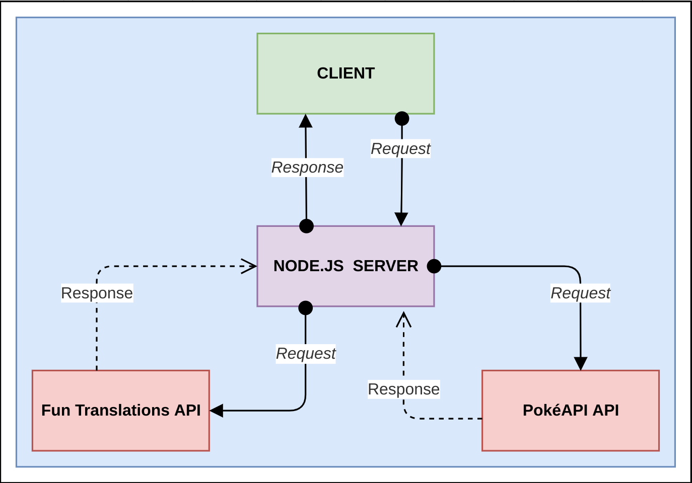

# true-layer-server

> A Node.js server that works as backend service for [true-layer-client](https://github.com/HereBeAndre/true-layer-client).
> It communicates with [PokéAPI](https://pokeapi.co/) and [Fun Translations API](https://funtranslations.com/api/) in order to provide data to the client.

## General Information

> This project was bootstrapped with [Express application generator](https://expressjs.com/en/starter/generator.html).

## Table of Contents

- [true-layer-server](#true-layer-server)
  - [General Information](#general-information)
  - [Table of Contents](#table-of-contents)
  - [Getting started](#getting-started)
    - [Pre-requisites](#pre-requisites)
    - [Installation](#installation)
  - [Architecture](#architecture)
  - [APIs](#apis)
  - [Available Scripts](#available-scripts)
    - [Testing](#testing)
    - [Production Build](#production-build)
  - [Room for Improvement](#room-for-improvement)
  - [License](#license)

## Getting started

### Pre-requisites

- Install [Node.js](https://nodejs.org/en/) version 14.17.5

### Installation

- Clone the repository via SSH

```
git clone git@github.com:HereBeAndre/true-layer-server.git
```

- Or clone it via HTTPS

```
git clone https://github.com/HereBeAndre/true-layer-server.git
```

- Install dependencies

```
cd true-client-server
npm install
```

The complete list of dependencies is included in `./package-lock.json`.

- Run the project

```
npm start
```

The server listens on port `8080`.

## Architecture

&nbsp;&nbsp;

## APIs

> - **PokéAPI** - (https://pokeapi.co/)
> - **Fun Translations API** - (https://funtranslations.com/api/)

> **Note**: Fun Translations API ratelimits the number of public API calls to 60 API calls a day with distribution of 5 calls an hour.\
> When that limit is exceeded, `true-layer-client` will receive the original Pokémon description provided by PokéAPI.

## Available Scripts

In the project directory, you can run:

| Npm Script     | Description                                                                    |
| -------------- | ------------------------------------------------------------------------------ |
| `npm start`    | Runs the app in the development mode via `node` command.                       |
|                | Open [http://localhost:8080](http://localhost:8080) to view it in the browser. |
| `npm run dev`  | Runs the app in the development mode via `nodemon` tool.                       |
|                | `nodemon` automatically restarts the node application on files changes.        |
| `npm run test` | Runs tests using Jest and SuperTest.                                           |

### Testing

The tests are written in Jest and the HTTP assertions done using SuperTest.\
Test files are created under `tests` folder.

### Production Build

[Deploying to production](https://developer.mozilla.org/en-US/docs/Learn/Server-side/Express_Nodejs/deployment)

## Room for Improvement

Todo:

- [ ] Implement environment variables management for production, development and testing envs.

Known bugs:

- List bugs here

## License

This project is licensed under the terms of the MIT license.
